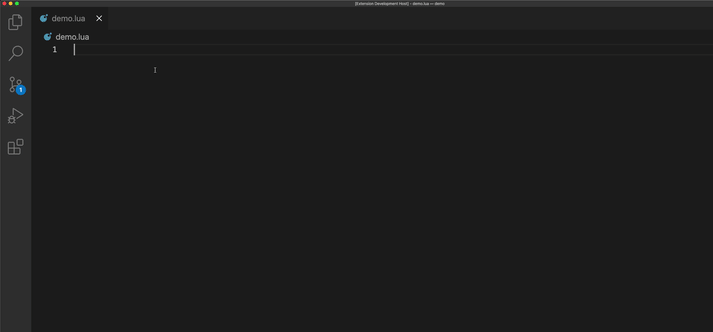

[](https://www.codacy.com/gh/sisoe24/hammerspoon-vscode/dashboard?utm_source=github.com&amp;utm_medium=referral&amp;utm_content=sisoe24/hammerspoon-vscode&amp;utm_campaign=Badge_Grade)
[](https://www.codacy.com/gh/sisoe24/hammerspoon-vscode/dashboard?utm_source=github.com&utm_medium=referral&utm_content=sisoe24/hammerspoon-vscode&utm_campaign=Badge_Coverage)
[](https://deepsource.io/gh/sisoe24/hammerspoon-vscode/?ref=repository-badge)

[](https://marketplace.visualstudio.com/items?itemName=virgilsisoe.hammerspoon)
[](https://marketplace.visualstudio.com/items?itemName=virgilsisoe.hammerspoon&ssr=false#version-history)
[](https://marketplace.visualstudio.com/items?itemName=virgilsisoe.hammerspoon)
[](https://marketplace.visualstudio.com/items?itemName=virgilsisoe.hammerspoon&ssr=false#review-details)
[](https://marketplace.visualstudio.com/items?itemName=virgilsisoe.hammerspoon)

# 1. Hammerspoon-vscode README

Visual Studio Code Hammerspoon extension for autocomplete and more.



- [1. Hammerspoon-vscode README](#1-hammerspoon-vscode-readme)
  - [1.1. Features](#11-features)
  - [1.2. Description](#12-description)
  - [1.3. Available Commands](#13-available-commands)
    - [1.3.1. Notes](#131-notes)
  - [1.4. Extension settings](#14-extension-settings)
  - [1.5. Known Issues](#15-known-issues)
  - [1.6. Requirements](#16-requirements)
  - [1.7. TODO](#17-todo)
  - [1.8. Acknowledgment](#18-acknowledgment)

## 1.1. Features

- Hammerspoon code suggestions.
- Hover information for types and documentation.
- Signature help for functions arguments.
- Reload Hammerspoon configuration command. (Requires `hs.ipc`. See [Requirements](#16-requirements))
- Spoon utilities:
  - Create Spoon template.
  - Generate Spoon documentation. (Requires `hs.ipc`. See [Requirements](#16-requirements))
- Hammerspoon console output to Visual Studio Code output window. (Requires `hs.ipc`. See [Requirements](#16-requirements))

## 1.2. Description

This extension is a cheap and dirty attempt to create an IntelliSense environment for Hammerspoon.

The way it works is by creating a symbol table of the script. Then the extension
parses Hammerspoon documentation in search of the object information.

This method is far from perfect and it likely will fail under some circumstances
(multi nested method calls, complex scripts, "classes" etc.) but it gets the job
done for the most basic ones.

## 1.3. Available Commands

By default, the extension does not provide any shortcut. But you can assign each command to one. (see Key Bindings for Visual Studio Code for more information).

All commands are available by opening the Command Palette `Command+Shift+P` and
typing in one of the following Command Name:

| Command Name                                    | Command ID                        | Description                            |
| ----------------------------------------------- | --------------------------------- | -------------------------------------- |
| `Hammerspoon: Reload Hammerspoon configuration` | `hammerspoon.reloadConfiguration` | Reload Hammerspoon configuration       |
| `Hammerspoon: Show Hammerspoon Console`         | `hammerspoon.showConsole`         | Show Hammerspoon console               |
| `Hammerspoon: Create Spoon`                     | `hammerspoon.createSpoon`         | Quick Spoon startup template           |
| `Hammerspoon: Generate Spoon Documentation`     | `hammerspoon.generateSpoonDoc`    | Generate `docs.json` for current spoon |
| `Hammerspoon: Update completion documentation`  | `hammerspoon.updateDatabase`      | Generate new completion data           |

### 1.3.1. Notes

- `Hammerspoon: Reload Hammerspoon configuration` command can be executed via a button in the Editor Toolbar.

  

- The Spoon template will get created in the `Hammerspoon: Spoons: Path` configuration
value which defaults to `.hammerspoon/Spoons`.
- When generating documentation for the Spoon, the editor's current active file must be a `init.lua`.

## 1.4. Extension settings

- `Spoons: Extra Documentation` - `hammerspoon.spoon.extraDocumentation`

  To generate the extra documentation (HTML/Markdown), you need to have access
  to the Hammerspoon source code repository with its python dependency.

  From Hammerspoon official [documentation](https://github.com/Hammerspoon/hammerspoon/blob/master/SPOONS.md#generating):

  > - Clone <https://github.com/Hamerspoon/hammerspoon>
  > - Install the required Python dependencies (e.g. `pip install --user -r requirements.txt` in the Hammerspoon repo)

  With that done, the setting takes two options:
  - `repository-path`: The Hammerspoon source code repository path.
  - `interpreter-path`: The Python interpreter path of the Hammerspoon source code repository.

  Example:

  ```json
  "hammerspoon.spoons.extraDocumentation": {
      "repository-path": "/Users/virgil/Developer/SourceCode/hammerspoon",
      "interpreter-path": "/Users/virgil/Developer/SourceCode/hammerspoon/.venv/bin/python"
  }
  ```

- `Spoons: Path` - `hammerspoon.spoons.path`

  The ath where to create the Spoons. Defaults to `~/.hammerspoon/Spoons`. If a custom path is specified, remember to add it to your `init.lua`.

  From Hammerspoon official [documentation](https://github.com/Hammerspoon/hammerspoon/blob/master/SPOONS.md#loading-a-spoon):

  >Note that `hs.loadSpoon()` uses package.path to find Spoons. Hence you can have it look for Spoons in other paths by adding those paths to package.path as follows:
  >
  > ```lua
  > -- Look for Spoons in ~/.hammerspoon/MySpoons as well
  > package.path = package.path .. ";" ..  hs.configdir .. "/MySpoons/?.spoon/init.lua"
  > ```

- `Console: Focus Output Window` - `hammerspoon.console.focusOutputWindow`

  When reloading Hammerspoon from the extension command, focus directly on the output window.

  > Tip: I always have `hs.console.clearConsole()` at the top of the `init.lua` since
  > it gets pretty messy understanding where starts what.

- `Console: Filter Output` -`hammerspoon.console.filterOutput`

  An array of regex patterns. Useful to filter out the Hammerspoon console output inside VScode.

  Example:

  ```json
  {
    "hammerspoon.console.filterOutput": [
      "➡.+",
      "ERROR:.+"
    ]
  }
  ```

  

  > Tip: I use the extension [Python EasyPrint](https://marketplace.visualstudio.com/items?itemName=virgilsisoe.python-easy-print) (which also works on Lua) to quickly print debug statements. The print statement always starts with a Unicode char `➡`, which I can use in the regex filter.

## 1.5. Known Issues

- If the script contains syntax errors, the extension will not work (If you don't use it
  already, I suggest the [Lua Language Server](https://marketplace.visualstudio.com/items?itemName=sumneko.lua) extension)
- Methods will return a value only if the value is an Hammerspoon data type. (eg. `hs.application`, `hs.window` etc.)
- Some methods will return an Hammerspoon data type even if it could potentially be something else:

  

  Although `mainWindow` could be `hs.window` or `nil`, the extension will always
  assume to be a `hs.window`.

- If a method returns anything other than a valid Hammerspoon data type
  (eg. `string`, `table`, `bool` etc.), it will only affect the hovering
  information, but suggestions will not be available.

  

  Hovering over `windows` will show: `list of hs.window objects` just as simple hover information.

- Lua 5.4 is not technically supported, but your script can contain the `<const>` and `<close>` new keywords.
- And probably more...

## 1.6. Requirements

- Some commands depend on the `hs.ipc` module. To install it, execute `hs.ipc.cliInstall()`
 in your Hammerspoon environment and call it at the beginning of your `init.lua`
 with `require('hs.ipc')` (more on [module documentation](http://www.hammerspoon.org/docs/hs.ipc.html)).
 If you are on an Apple silicon Mac, you might need to follow
 [those instructions](https://github.com/Hammerspoon/hammerspoon/issues/2930#issuecomment-899092002) to properly install the module.
  
## 1.7. TODO

- [ ] Show error/problems.
- [ ] Declaration on different file.
- [ ] Type annotations.
- [ ] Expand suggestions for non Hammerspoon data type returns.

## 1.8. Acknowledgment

[luaparse](https://github.com/fstirlitz/luaparse) for generating the symbol table.
