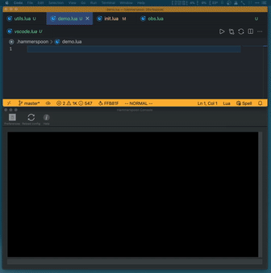

[](https://www.codacy.com/gh/sisoe24/hammerspoon-vscode/dashboard?utm_source=github.com&amp;utm_medium=referral&amp;utm_content=sisoe24/hammerspoon-vscode&amp;utm_campaign=Badge_Grade)
[](https://www.codacy.com/gh/sisoe24/hammerspoon-vscode/dashboard?utm_source=github.com&utm_medium=referral&utm_content=sisoe24/hammerspoon-vscode&utm_campaign=Badge_Coverage)
<!-- [](https://deepsource.io/gh/sisoe24/hammerspoon-vscode/?ref=repository-badge) -->

[](https://marketplace.visualstudio.com/items?itemName=virgilsisoe.hammerspoon)
[](https://marketplace.visualstudio.com/items?itemName=virgilsisoe.hammerspoon&ssr=false#version-history)
[](https://marketplace.visualstudio.com/items?itemName=virgilsisoe.hammerspoon)
[](https://marketplace.visualstudio.com/items?itemName=virgilsisoe.hammerspoon&ssr=false#review-details)
[](https://marketplace.visualstudio.com/items?itemName=virgilsisoe.hammerspoon)

[](https://open-vsx.org/extension/virgilsisoe/hammerspoon)
[](https://open-vsx.org/extension/virgilsisoe/hammerspoon/changes)
[](https://open-vsx.org/extension/virgilsisoe/hammerspoon)
[](https://open-vsx.org/extension/virgilsisoe/hammerspoon/reviews)

- [1. Hammerspoon-vscode README](#1-hammerspoon-vscode-readme)
  - [1.1. Features](#11-features)
  - [1.2. Requirements](#12-requirements)
  - [1.3. Stubs](#13-stubs)
    - [1.3.1. Notes:](#131-notes)
  - [1.4. Evaluate Hammerspoon code](#14-evaluate-hammerspoon-code)
  - [1.5. Socket connection](#15-socket-connection)
  - [1.6. Available Commands](#16-available-commands)
    - [1.6.1. Notes](#161-notes)
  - [1.7. Extension settings](#17-extension-settings)
  - [1.8. Known Issues](#18-known-issues)
  - [1.9. Acknowledgment](#19-acknowledgment)

# 1. Hammerspoon-vscode README

Unofficial Hammerspoon extension for Visual Studio Code.

## 1.1. Features

- IntelliSense for Hammerspoon API (requires [Lua Language Server](https://marketplace.visualstudio.com/items?itemName=sumneko.lua)).
- Evaluate Hammerspoon code from vscode without reloading the configuration. (thanks to @velios).
- Execute vscode commands from Hammerspoon via [socket connection](#13-socket-connection).
- Reload Hammerspoon configuration command. (Requires `hs.ipc`. See [Requirements](#16-requirements))
- Hammerspoon console output to Visual Studio Code output window. (Requires `hs.ipc`. See [Requirements](#16-requirements))
- Spoon utilities:
  - Create Spoon template.
  - Generate Spoon documentation. (Requires `hs.ipc`. See [Requirements](#16-requirements))

## 1.2. Requirements

- [Lua Language Server](https://marketplace.visualstudio.com/items?itemName=sumneko.lua) extension (it is included with the extension pack by default).
- [hs.ipc](http://www.hammerspoon.org/docs/hs.ipc.html) module installed.
  Some commands depend on the `hs.ipc` module. To install it, execute `hs.ipc.cliInstall()` in your Hammerspoon environment and call it at the beginning of your `init.lua` with `require('hs.ipc')` (more on [module documentation](http://www.hammerspoon.org/docs/hs.ipc.html)).
  If you are on an Apple silicon Mac, you might need to follow [those instructions](https://github.com/Hammerspoon/hammerspoon/issues/2930#issuecomment-899092002) to properly install the module.
- [EmmyLua.spoon](https://github.com/Hammerspoon/Spoons/raw/master/Spoons/EmmyLua.spoon.zip): The extensions offers a quick utility command to download and generate the stubs. See [Stubs](#13-stubs) for more information.

## 1.3. Stubs

The extension now uses the [Lua Language Server](https://marketplace.visualstudio.com/items?itemName=sumneko.lua) to provide IntelliSense. In order to provide the Hammerspoon API, the extension uses the [EmmyLua.spoon](https://github.com/Hammerspoon/Spoons/raw/master/Spoons/EmmyLua.spoon.zip) stubs from the official Hammerspoon Spoons repository. The extensions offers a quick utility command to download and generate the stubs. The command `Hammerspoon: Add Stubs` will:

1. Download the EmmyLua stubs.
2. Place them in the Hammerspoon spoons directory (default: `~/.hammerspoon/Spoons`).
3. Import them in the `init.lua` file.
4. Add them to the `Lua.workspace.library` setting.
5. Reload the Hammerspoon configuration.

Once the stubs are added, you might need to reload VSCode for the changes to take effect.

### 1.3.1. Notes:

- Some stubs might fail to load especially when constructors are involved. In that case, you can add always add the type annotation manually:

  ```lua
  ---@type hs.application
  local app = hs.application("Safari")
  ```
- The `EmmyLua.spoon` will try to compile the stubs also for your custom spoons. This can cause an error if there is something wrong with your spoon `docs.json`.
- The extension still supports the old way of providing the API, but it is highly recommended to use the new method. The old method can be enabled/disabled via the `hammerspoon.enableLegacyProviders` setting.

## 1.4. Evaluate Hammerspoon code

You can evaluate Hammerspoon code from vscode without reloading the configuration. To do so, you need to have the `hs.ipc` module installed. See [Requirements](#16-requirements) for more information.

To evaluate code, you can use one of the following commands:

- `Hammerspoon: Evaluate Line`: Evaluate the current line.
- `Hammerspoon: Evaluate File`: Evaluate the entire file.
- `Hammerspoon: Evaluate Selection`: Evaluate the selected code.

> The commands are also available in the editor context menu.

## 1.5. Socket connection

You can execute vscode commands from Hammerspoon by sending data via the `socket` module.

```lua
socket = hs.socket.new()
socket:connect('localhost', 54321)
socket:send('workbench.action.toggleZenMode')

-- calling socket:disconnect() immediately, will fail to register the message
hs.timer.doAfter(1, function() socket:disconnect() end)
```

You can also write arguments inside curly brackets and delimit them by a comma: `{arg1, arg2}`

```lua
socket:send('workbench.action.tasks.runTask {My Task}')
```

For the extension to accept incoming data, you need to start the server
via the command: `Hammerspoon: Toggle server connection` or via the button in lower the
status bar and specify the port in the extension settings (default: `54321`).

## 1.6. Available Commands

All commands are available by opening the Command Palette `Command+Shift+P` and
typing in one of the following Command Name:

| Command Name                                    | Command ID                        | Description                                                                   |
| ----------------------------------------------- | --------------------------------- | ----------------------------------------------------------------------------- |
| `Hammerspoon: Add Stubs`                        | `hammerspoon.addStubs`            | Add EmmyLua stubs to the Hammerspoon Spoons directory                         |
| `Hammerspoon: Reload Hammerspoon configuration` | `hammerspoon.reloadConfiguration` | Reload Hammerspoon configuration                                              |
| `Hammerspoon: Show Hammerspoon Console`         | `hammerspoon.showConsole`         | Show Hammerspoon console                                                      |
| `Hammerspoon: Toggle server connection`         | `hammerspoon.createSpoon`         | Toggle connection that allows incoming data to be executed as vscode commands |
| `Hammerspoon: Create Spoon`                     | `hammerspoon.createSpoon`         | Quick Spoon startup template                                                  |
| `Hammerspoon: Generate Spoon Documentation`     | `hammerspoon.generateSpoonDoc`    | Generate `docs.json` for current spoon                                        |

### 1.6.1. Notes

- `Hammerspoon: Reload Hammerspoon configuration` command can be executed via a button in the Editor Toolbar.

  

- The Spoon template will get created in the `Hammerspoon: Spoons: Path` configuration
value which defaults to `.hammerspoon/Spoons`.
- When generating documentation for the Spoon, the editor's current active file must be a `init.lua`.
- By default, the extension does not provide any shortcut. But you can assign each command to one. (see Key Bindings for Visual Studio Code for more information).

## 1.7. Extension settings

- `Console: Focus Output Window` - `hammerspoon.console.focusOutputWindow`

  Focus the output window when a message is received from Hammerspoon. Defaults to `true`.

  > Tip: I always have `hs.console.clearConsole()` at the top of the `init.lua` since
  > it gets pretty messy understanding where starts what.

- `Console: Filter Output` -`hammerspoon.console.filterOutput`

  An array of regex patterns. Useful to filter out the Hammerspoon console output inside VScode.

  Example:

  ```json
  {
    "hammerspoon.console.filterOutput": [
      "➡.+",
      "ERROR:.+"
    ]
  }
  ```

  

  > Tip: I use the extension [Python EasyPrint](https://marketplace.visualstudio.com/items?itemName=virgilsisoe.python-easy-print) (which also works on Lua) to quickly print debug statements. The print statement always starts with a Unicode char `➡`, which I can use in the regex filter.

- `Network: Port` - `hammerspoon.network.port`: `number`

  A port to use for incoming connection when sending message from Hammerspoon.
  Defaults to `54321`.
- `Spoons: Extra Documentation` - `hammerspoon.spoon.extraDocumentation`

  To generate the extra documentation (HTML/Markdown), you need to have access
  to the Hammerspoon source code repository with its python dependency.

  From Hammerspoon official [documentation](https://github.com/Hammerspoon/hammerspoon/blob/master/SPOONS.md#generating):

  > - Clone <https://github.com/Hamerspoon/hammerspoon>
  > - Install the required Python dependencies (e.g. `pip install --user -r requirements.txt` in the Hammerspoon repo)

  With that done, the setting takes two options:
  - `repository-path`: The Hammerspoon source code repository path.
  - `interpreter-path`: The Python interpreter path of the Hammerspoon source code repository.

  Example:

  ```json
  "hammerspoon.spoons.extraDocumentation": {
      "repository-path": "/Users/virgil/Developer/SourceCode/hammerspoon",
      "interpreter-path": "/Users/virgil/Developer/SourceCode/hammerspoon/.venv/bin/python"
  }
  ```

- `Spoons: Path` - `hammerspoon.spoons.path`

  The path where to create the Spoons. Defaults to `~/.hammerspoon/Spoons`. If a custom path is specified, remember to add it to your `init.lua`.

  From Hammerspoon official [documentation](https://github.com/Hammerspoon/hammerspoon/blob/master/SPOONS.md#loading-a-spoon):

  >Note that `hs.loadSpoon()` uses package.path to find Spoons. Hence you can have it look for Spoons in other paths by adding those paths to package.path as follows:
  >
  > ```lua
  > -- Look for Spoons in ~/.hammerspoon/MySpoons as well
  > package.path = package.path .. ";" ..  hs.configdir .. "/MySpoons/?.spoon/init.lua"
  > ```

## 1.8. Known Issues

- The legacy providers are incomplete and might not work as expected.
- When executing code from VSCode, the command might fail if you have convoluted escaping quotes in your code. (e.g. `hs.alert.show("Hello \"World "MY" \"")`).

## 1.9. Acknowledgment

[luaparse](https://github.com/fstirlitz/luaparse) for generating the symbol table.
[EmmyLua](https://github.com/Hammerspoon/Spoons/raw/master/Spoons/EmmyLua.spoon.zip) for the stubs.
